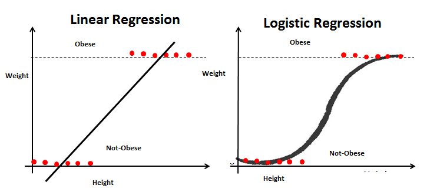
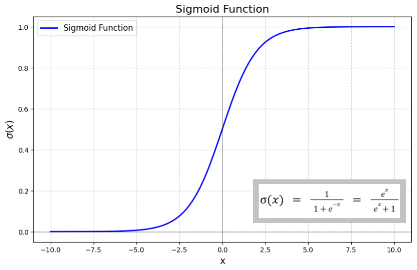

#  Logistic Regression 

## 1. What is a Classification Problem?

* In **regression**, output can be any continuous value
  → e.g., price, temperature

* In **classification**, output is **discrete**

  * Binary → `0 or 1`
  * Multi-class → `0,1,2...`

👉 Logistic Regression is used for **binary classification**

---

## 2. Why NOT Linear Regression for Classification?

* Linear regression outputs:

  ```
  (-∞, +∞)
  ```

* Problem:

  * Predictions can be **< 0 or > 1**
  * Sensitive to **outliers**
  * Decision boundary becomes unstable

👉 So we need something that **restricts output between 0 and 1**

---

## 3. Solution → Sigmoid Function

We "squash" the linear output into a probability.

$$
f(z)=\frac{1}{1+e^{-z}}
$$

### Properties:

* Output range: `(0, 1)`
* If:

  * `z > 0` → output > 0.5
  * `z < 0` → output < 0.5

👉 Perfect for probability



---

## 4. Logistic Regression Model

### Step 1: Linear Equation

$$
z = \theta_0 + \theta_1 x
$$

### Step 2: Apply Sigmoid

$$
\hat{y} = \sigma(z)
$$

👉 Final model:
$$
\hat{y} = \frac{1}{1 + e^{-(\theta_0 + \theta_1 x)}}
$$



---

## 5. Interpretation

* Output = **probability**

  * `≥ 0.5 → Class 1`
  * `< 0.5 → Class 0`

👉 Decision boundary:
$$
\theta_0 + \theta_1 x = 0
$$

