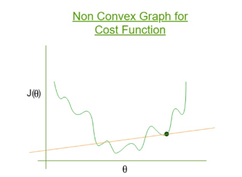

## 1. Cost Function in Linear Regression

For one data point:

$$
\text{Cost}(y, \hat{y}) = (y - \hat{y})^2
$$

For all data:

$$
J(\theta) = \frac{1}{2m} \sum_{i=1}^{m} (y^{(i)} - \hat{y}^{(i)})^2
$$

Where:

* $\hat{y} = h(x) = \theta_0 + \theta_1 x$

---

## 2. Now Apply Same Idea to Logistic Regression

We keep **same structure**, just change prediction:

👉 Instead of:
$$
\hat{y} = h(x)
$$

👉 Use sigmoid:
$$
\hat{y} = \sigma(h(x))
$$

So cost becomes:

$$
\text{Cost}(y, \hat{y}) = (y - \sigma(h(x)))^2
$$

---

## 3. Problem with This Cost Function

You assumed:

> Cost(y, ŷ) = (y - ŷ)²

###  What goes wrong?

* Sigmoid is **non-linear**
* Squaring makes it worse

👉 Result:

* Cost function becomes **non-convex**
* Multiple local minima 
* Gradient descent can get stuck 

---

## 4. So We Redefine Cost(y, ŷ)

Instead of squaring error, we define cost **based on probability**

---

### Case 1: When actual y = 1

We want:

* If prediction is close to 1 → low cost
* If prediction is close to 0 → huge cost

So we use:

$$
\text{Cost}(y, \hat{y}) = -\log(\hat{y})
$$

---

### Case 2: When actual y = 0

We want:

* If prediction is close to 0 → low cost
* If prediction is close to 1 → huge cost

So:

$$
\text{Cost}(y, \hat{y}) = -\log(1 - \hat{y})
$$

---

## 5. Combine Both Cases

Instead of writing two formulas:

$$
Cost(y,\hat{y})=-y\log(\hat{y})-(1-y)\log(1-\hat{y})
$$

👉 This automatically switches based on y

---

## 6. Final Cost Function

$$
J(\theta) = \frac{1}{m} \sum_{i=1}^{m} \left[-y^{(i)} \log(\hat{y}^{(i)}) - (1 - y^{(i)}) \log(1 - \hat{y}^{(i)}) \right]
$$

Where:
$$
\hat{y} = \sigma(h(x))
$$

---

## 7. Gradient Descent Update

Update rule:

$$
\theta_j = \theta_j - \alpha \frac{\partial J}{\partial \theta_j}
$$

After derivation (important result):

$$
\frac{\partial J}{\partial \theta_j} = \frac{1}{m} \sum ( \hat{y} - y ) x_j
$$

👉 So update becomes:

$$
\theta_j = \theta_j - \alpha \cdot \frac{1}{m} \sum ( \hat{y} - y ) x_j
$$

---

## 8. Why We DON’T Use 1/2m Here

In linear regression:

$$
\frac{1}{2m}
$$

👉 Reason:

* Squared term gives `2` during derivative
* 1/2 cancels it

---

### In Logistic Regression:

* No square term → no `2`
* Derived from **log-likelihood**, not squared error

👉 So:
$$
\frac{1}{m} \text{ is enough}
$$

---

