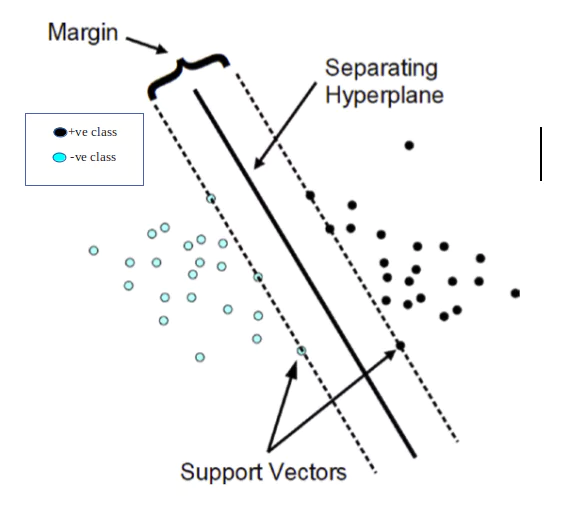

## 1. Start: Logistic regression idea

Logistic regression says:

> Find a line (or hyperplane) that separates the classes and predicts probabilities.

Mathematically it learns weights **w** such that:

* positive class → probability close to 1
* negative class → probability close to 0

But here is the problem researchers noticed:

**Many different lines can separate the same data.**

Example:

```
Line A  |  Line B  |  Line C
```

All three might classify correctly.

Logistic regression **does not care which separating line you choose**, as long as prediction probabilities are good.

That raised an important question.

---

## 2. New question researchers asked

Instead of just separating classes, what if we ask:

> **Which separating line is the safest one?**

Meaning:

Which line stays **farthest away from the data points of both classes**?

This led to the concept of **margin**.

---

## 3. Idea of margin

The **margin** is the distance between the separating line and the nearest data points.

Example:



Researchers realized something important:

A **larger margin boundary generalizes better to unseen data**.

Why?

Because if the boundary is far from training points, **small noise in data won’t flip predictions easily**.

This insight is what triggered the birth of SVM.

---

## 4. New objective

Instead of maximizing likelihood like logistic regression does, SVM asks:

> Find the boundary that **maximizes the margin**.

So the optimization becomes:

* maximize distance from closest points
* minimize weight magnitude

The closest points become the **support vectors**.

---


## 5. So the evolution in one sentence

The thinking evolved like this:

1. Logistic regression → find a separating boundary
2. Researchers ask → which boundary is best?
3. Idea emerges → maximize margin
4. Mathematical formulation → Support Vector Machine
5. Kernel trick → handle nonlinear patterns

---

## honest insight

It’s basically:

> **“Logistic regression, but obsessed with maximizing margin.”**

---
