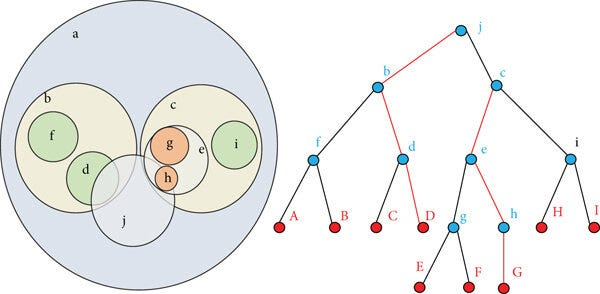

## Ball Tree

Ball Tree is another data structure used to **speed up nearest neighbor search** in algorithms like
K-Nearest Neighbors.

Instead of splitting space with **axis-aligned lines like KD-Tree**, Ball Tree groups data points into **spherical regions (balls)**.

---

## 1. Why Ball Tree Exists

KD-Tree works well when:

* number of dimensions is **small**

But when dimensions grow (20, 50, 100 features), KD-Tree becomes inefficient.

Ball Tree handles **higher-dimensional data better** because it splits space using **distance from a center**, not coordinate axes.

---

## 2. Core Idea

A **ball** is defined by:

* a **center point**
* a **radius**

All points inside that radius belong to that ball.

So Ball Tree divides data into **nested balls**.

Think of it like:

```
big ball
 ├── smaller ball
 └── smaller ball
```

Each ball contains a subset of points. \


---

## 3. Definition

A Ball Tree is a **binary tree** where:

Each node stores:

* center of the ball
* radius
* subset of points inside that ball

Children nodes represent **smaller balls inside the parent ball**.

---

## 4. Ball Tree Construction Algorithm

Given a dataset of points:

### Step 1

Find the **center of the dataset**.

Usually the centroid or a representative point.

---

### Step 2

Compute the **radius**.

Radius = distance from center to the **farthest point**.

Now you have a ball covering all points.

---

### Step 3

Split points into two groups.

Common method:

1. Pick two farthest points
2. Use them as pivots
3. Assign each point to the nearest pivot

This forms **two smaller balls**.

---

### Step 4

Repeat recursively until:

* nodes contain few points.

---

## 5. Example (2D)

Points:

```
A (2,3)
B (5,4)
C (9,6)
D (4,7)
E (8,1)
F (7,2)
```

---

## Step 1 — Create root ball

Compute center (roughly):

```
center ≈ (6,4)
```

Compute radius:

Distance from center to farthest point.

Now all points lie inside this ball.

---

## Step 2 — Split into two balls

Choose two farthest points:

```
(2,3) and (9,6)
```

Now assign each point to the closer pivot.

Group 1:

```
(2,3)
(4,7)
(5,4)
```

Group 2:

```
(9,6)
(8,1)
(7,2)
```

Each group forms a **new ball**.

---

## Tree structure

```
           Root Ball
          /         \
     Ball 1        Ball 2
   (3 points)     (3 points)
```

Then each ball can split again.

---

## 6. Nearest Neighbor Search

Suppose query point:

```
Q = (6,3)
```

Steps:

1. Start at root ball.
2. Check which child ball is closer.
3. Search that ball first.
4. Track best distance found.
5. Skip other balls if their minimum possible distance is larger.

This **prunes large regions**.

So we avoid checking many points.

---

## 7. Time Complexity

| Operation  | Complexity       |
| ---------- | ---------------- |
| Build tree | O(N log N)       |
| Search     | O(log N) average |

Better than brute-force KNN:

```
O(N)
```

---

## 8. Difference from KD-Tree

| Feature        | KD Tree             | Ball Tree         |
| -------------- | ------------------- | ----------------- |
| Space division | axis-aligned splits | spherical regions |
| Works best for | low dimensions      | higher dimensions |
| Geometry       | rectangles          | balls             |

---

## 9. Intuition

KD-Tree:

```
split space with lines
```

Ball Tree:

```
group points inside circles
```

Ball Tree is like **clustering regions of space**.

---

## Honest Insight

In real ML libraries like **scikit-learn**:

KNN can automatically choose:

* KD-Tree
* Ball Tree
* brute force

depending on:

* dataset size
* number of features.

---

