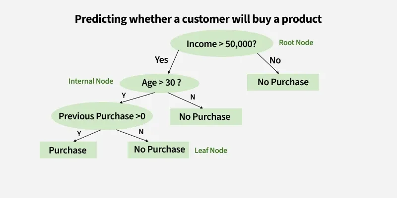

## Decision Trees — Basics

### What is a Decision Tree?

A **Decision Tree** is a supervised machine learning algorithm used for **classification and regression** tasks.

It works by **splitting data into smaller subsets based on feature values**, forming a structure that looks like a tree.

The algorithm repeatedly chooses the **best feature to split the data** until the data becomes pure enough.

Algorithms like

* ID3
* C4.5
* CART

are popular implementations of decision trees.

---

## Tree Terminology

A decision tree has several components:

**Root Node**

* The top node of the tree.
* Represents the entire dataset before any split.

**Internal Node**

* A node where the dataset is split based on a feature.

**Branch**

* Represents the outcome of a decision.

**Leaf Node (Terminal Node)**

* Final node where a prediction is made.



---

## What Decision Trees Are Used For

Decision trees are used in **both classification and regression problems**.

### Classification

Predicts **discrete categories**.

Example:

* Spam vs Not Spam
* Disease vs No Disease
* Fraud vs Legitimate transaction

### Regression

Predicts **continuous values**.

Example:

* House price prediction
* Sales forecasting

Libraries like scikit-learn provide

* `DecisionTreeClassifier`
* `DecisionTreeRegressor`

---

## How Decision Trees Work (High Level)

1. Start with the **entire dataset at the root node**.
2. Choose the **best feature to split the data**.
3. Split the dataset into **child nodes**.
4. Repeat the process for each child node.
5. Stop when:

   * nodes become pure, or
   * a stopping condition is reached.

The “best split” is usually chosen using measures like:

* **Entropy**
* **Information Gain**
* **Gini Impurity**

---

## Main Advantage of Decision Trees

### 1. Easy to Understand

Decision trees are **highly interpretable**.
You can literally follow the path from root to leaf and understand the decision.

Example:

```
Age > 30?
 ├── Yes → Income > 50k?
 │      ├── Yes → Buy Product
 │      └── No → Do Not Buy
 └── No → Do Not Buy
```

Even non-technical people can understand this.

---

### 2. No Feature Scaling Needed

Unlike algorithms such as

* Support Vector Machine
* K-Nearest Neighbors

decision trees **do not require normalization or standardization**.

---

### 3. Handles Non-Linear Data

Decision trees can model **complex decision boundaries** without needing complex math.

---

### 4. Works With Both Numerical and Categorical Data

They can split on:

* numeric features
* categorical features

---
