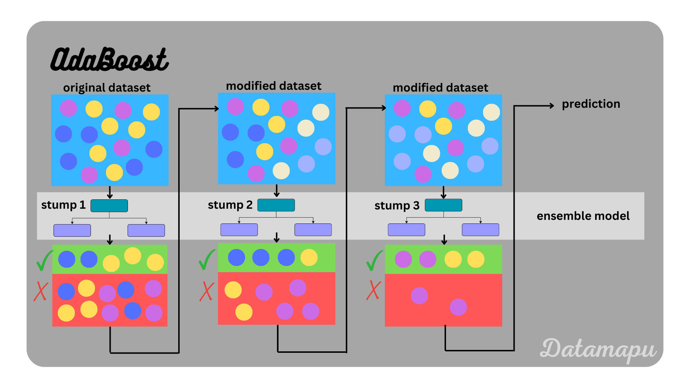

# AdaBoost – Part 1

## 1. What is Boosting?

Boosting is an **ensemble learning technique** where multiple **weak learners** are trained **sequentially** to create a **strong learner**.

A **weak learner** is a model that performs only **slightly better than random guessing**.

Instead of training all models independently, boosting trains models **one after another**, where each new model **focuses more on the data points that previous models predicted incorrectly**.

### Key Idea

1. Train the first weak learner on the dataset.
2. Identify the **misclassified samples**.
3. Increase the **importance (weight)** of those misclassified samples.
4. Train the next weak learner with this updated weighting.
5. Repeat the process.
6. Combine all weak learners into a **final strong model**.

The final prediction is obtained by **combining the outputs of all weak learners using weighted voting (for classification) or weighted averaging (for regression).**

Boosting can be used for:

* **Classification**
* **Regression**

Examples of boosting algorithms:

* AdaBoost
* Gradient Boosting
* XGBoost
* LightGBM
* CatBoost



---

## 2. AdaBoost (Adaptive Boosting)

AdaBoost is one of the earliest and most important boosting algorithms.

It works by **training weak learners sequentially and adjusting the weights of training samples based on previous errors.**

The algorithm is called **Adaptive Boosting** because it **adapts to the mistakes of previous models.**

---

## 3. Weak Learners in AdaBoost

In AdaBoost, the weak learners are typically **Decision Trees with very small depth**.

Most commonly:

**Decision Stumps**

A **decision stump** is a decision tree with:

```
max_depth = 1
```

This means the tree contains:

* One split
* Two leaf nodes

Because they are extremely simple, they cannot fully capture complex relationships in the data.

---

## 4. Bias–Variance Characteristics

Since the individual models are very simple:

Weak learners have:

* **High Bias**
* **Low Variance**

Reason:

They are **too simple to capture complex patterns** in the data, so they underfit.

But when many weak learners are combined through boosting, the final model becomes:

* **Low Bias**
* **Low Variance**

This is why boosting works extremely well.

---

## 5. Mathematical Representation

The final AdaBoost model is a **weighted combination of weak learners**.

AdaBoost additive model

$$
F(x) = \sum_{m=1}^{M} \lambda_m , h_m(x)
$$

Where:

* $M$ = number of weak learners
* $h_m(x)$ = prediction of the (m^{th}) weak learner
* $\lambda_m$ = weight assigned to that learner

So the final model is:

```
Final Model =
λ1 * Model1 +
λ2 * Model2 +
λ3 * Model3 +
...
λM * ModelM
```

Models that perform **better receive higher weights**, and weaker ones receive **lower weights**.

---