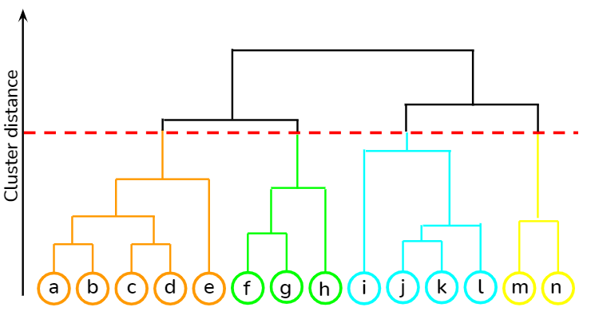

# Hierarchical Clustering

## 1. What is Hierarchical Clustering

Hierarchical clustering builds a **tree of clusters** instead of directly assigning points to clusters.

There are two approaches:

### Agglomerative (Bottom-Up)

Start with:

```
each data point = one cluster
```

Then repeatedly:

```
merge the closest clusters
```

until only **one cluster remains**.

This is the approach you studied.

---

### Divisive (Top-Down)

Start with:

```
all data points = one cluster
```

Then repeatedly:

```
split clusters
```

until each point becomes its own cluster.

Divisive is **rarely used in practice**.

---

## Agglomerative Clustering Algorithm

### Step 1

Treat every data point as an **individual cluster**.

Example:

```
A  B  C  D  E
```

Each point is its own cluster.

---

### Step 2

Compute **distance between clusters**.

Then merge the **closest clusters**.

Example:

```
(A,B) merge first
```

Now clusters become:

```
AB  C  D  E
```

---

### Step 3

Repeat the process.

```
find closest clusters
merge them
```

Example:

```
AB + C → ABC
```

---

### Step 4

Continue until **one cluster remains**.

```
ABCDE
```

This merging process creates a **hierarchical tree**.

---

## Dendrogram

A **dendrogram** visualizes the merging process.

Your drawing on page 1 shows this structure. 

Example structure:



Height of each merge represents:

```
distance between clusters
```


### Choosing Number of Clusters:

Look for the **largest vertical gap** in the dendrogram.

Draw a horizontal line.

If the horizontal line intersects **3 branches**:

```
k = 3 clusters
```

---

## How Do We Measure Distance Between Clusters?

Since clusters may contain **multiple points**, we need rules.

These rules are called **linkage methods**.

---

## Linkage Methods

### 1. Single Linkage

Distance between **closest points** of two clusters.

```
distance(cluster A, cluster B)
= min(distance between points)
```

Problem:

```
creates chain-like clusters
```

---

### 2. Complete Linkage

Distance between **farthest points**.

```
distance = max(distance between points)
```

Produces **compact clusters**.

---

### 3. Average Linkage

Average distance between all pairs of points.

```
distance = average(pairwise distances)
```

---

### 4. Ward Linkage

Ward does something different.

Instead of point distances, it minimizes:

```
increase in cluster variance
```

Meaning clusters remain:

```
tight
compact
spherical
```

This is why Ward behaves similar to **K-Means**.

---


## Dendrogram Code (Python)

```
import scipy.cluster.hierarchy as sc
import matplotlib.pyplot as plt

plt.figure(figsize=(20,7))
plt.title("Dendrogram")

sc.dendrogram(
    sc.linkage(x_train_d, method="ward")
)

plt.xlabel("Data Points")
plt.ylabel("Distance")
plt.show()
```

---

## Important Properties

### Deterministic

Unlike K-Means:

```
no random initialization
```

Result is **always the same**.

---

### Time Complexity

Hierarchical clustering requires:

```
O(n²)
```

distance computations.

So it works best when:

```
dataset size < 1000
```

---

