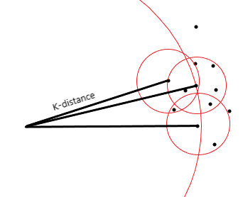

# Local Outlier Factor (LOF) 

## Idea of Outliers

There are two types of outliers:

**1. Global Outlier**
A point that is far from **the entire dataset**.

Example:

```
Cluster: 5 6 7 8 9
Outlier: 100
```

100 is globally far from all points.

---

**2. Local Outlier**

A point that looks normal globally but **is strange compared to its neighbors**.

Example:

```
Cluster A: 1 2 3 4
Cluster B: 100 101 102

Point: 50
```

50 may not be globally extreme but **it doesn't belong to any local group**, so it becomes a **local outlier**.

To detect such cases we use **Local Outlier Factor (LOF)**.

---

## Core Idea of LOF

LOF compares the **density of a point with the density of its neighbors**.

If the point is **much less dense than its neighbors**, it is considered an outlier.

---

## Steps in LOF

### Step 1 — Choose k

Choose **k nearest neighbors**.

---

### Step 2 — Distance to k nearest neighbors

For point **P**:

Find distance to its **k nearest neighbors**.

Compute:

```
Average distance from P to its k nearest neighbors
```

This represents the **local density of point P**.

---

### Step 3 — Neighbor Density

For each of the **k neighbors**, compute:

```
Average distance from that neighbor to its own k nearest neighbors
```

This gives **density of the surrounding region**.

---

### Step 4 — Compare Densities

Now compare:

```
Density of P
vs
Density of its neighbors
```

Cases:

**If densities are similar**

```
Point is normal
```

**If P has much lower density**

```
Point is an outlier
```

---

## LOF Score Interpretation

| LOF Score | Meaning          |
| --------- | ---------------- |
| ≈ 1       | normal point     |
| > 1       | possible outlier |
| >> 1      | strong outlier   |

---

## Simple Intuition

LOF asks:

> “Is this point living in a region much less dense than its neighbors?”

If yes → **outlier**

---


